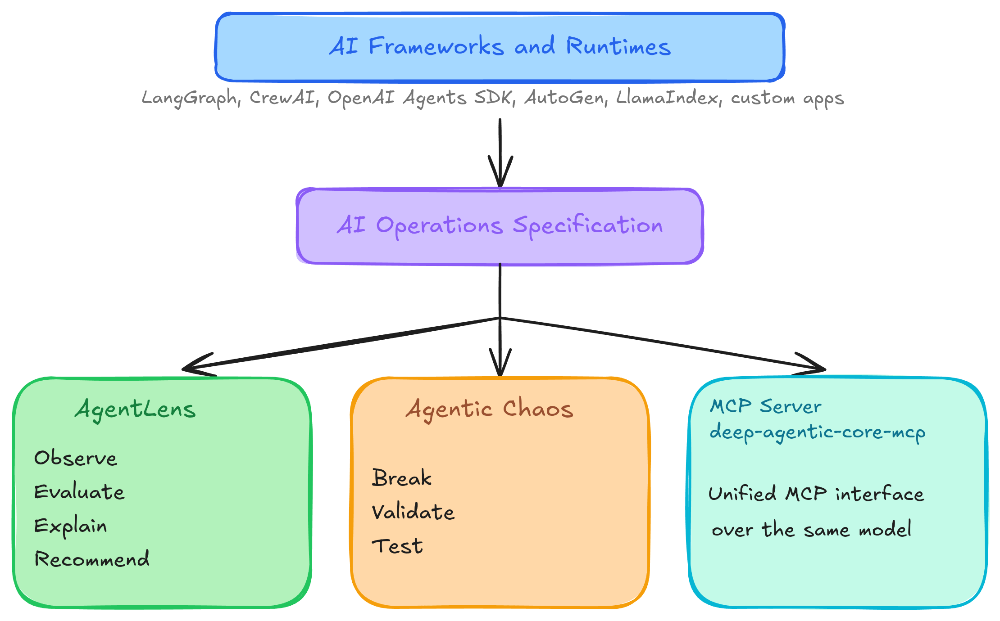

# DeepAgentLabs

## An Open AI Operations Ecosystem

DeepAgentLabs builds **open operational infrastructure for production AI
systems**.

## The Shared Foundation

### [ai-operations-spec](https://github.com/DeepAgentLabs/ai-operations-spec)

The **AI Operations Specification** is the center of gravity for the ecosystem.
It is a language-neutral, versioned operational model for production AI
systems.

It defines the shared contract for:

- workflow artifacts such as `workflow.json`
- schema validation
- evaluation and incident interoperability
- resilience and degradation evidence
- future extensions across tools and frameworks

This repository contains the specification itself: written rules, versioning
guidance, schemas, examples, and extension conventions.

## The Reference Implementations

### [agenticlens](https://github.com/DeepAgentLabs/agenticlens)

[](https://pypi.org/project/agenticlens/)
[](https://pypi.org/project/agenticlens/)

The observability, evaluation, and operational intelligence layer. It tells you
what happened, how well the system performed, where cost, latency, and risk
came from, and whether things are getting better or worse.

AgenticLens is the flagship Python reference implementation of the AI
Operations Specification.

```bash
pip install agenticlens
```

### [agentic-chaos](https://github.com/DeepAgentLabs/agentic-chaos)

[](https://pypi.org/project/agentic-chaos/)
[](https://pypi.org/project/agentic-chaos/)

The resilience and failure-validation layer. It deliberately breaks AI
workflows so teams can test reliability, recovery, fault tolerance, and
degraded behavior before production incidents do it for them.

Agentic Chaos produces resilience and degradation artifacts that remain
compatible with the shared specification.

```bash
pip install agentic-chaos
```

### [deep-agentic-core-mcp](https://github.com/DeepAgentLabs/mcp-server)

[](https://pypi.org/project/deep-agentic-core-mcp/)
[](https://pypi.org/project/deep-agentic-core-mcp/)

The unified MCP control surface. It exposes the shared operational model and
the capabilities of both tools through one interface for hosts, agents, and
external systems.

```bash
pip install deep-agentic-core-mcp
```

## The Center of Gravity

At the center of the ecosystem is the **AI Operations Specification**.

It is not owned by a single package. DeepAgentLabs defines and stewards the
specification so multiple tools can share one operational contract.

This turns `workflow.json` into a first-class artifact rather than an internal
implementation detail, with `workflow.schema.json` and written specification
documents defining the contract around it.

All ecosystem tools are aligned around the **AI Operations Specification** as
the canonical operational model for production AI systems.

- Spec repo: [ai-operations-spec](https://github.com/DeepAgentLabs/ai-operations-spec)

## Summary

The ecosystem serves as an open operational framework for production AI
systems, similar in spirit to OpenTelemetry but purpose-built for AI systems
and agentic workflows. It makes applications observable, testable, and
manageable through a structured, shared data model.

## How They Fit Together



Each package is independently installable and useful on its own. They compose
through the shared specification rather than hard-coded dependencies.

## Philosophy

- **Architecture-first:** the ecosystem is organized around one shared
  operational model and specification.
- **Package-first:** core capabilities ship as installable Python packages.
- **Local-first:** artifacts work in local development and CI without a hosted
  backend.
- **Framework-agnostic:** the operational model stays broader than any one SDK.
- **Composable by default:** one shared specification, multiple reference
  implementations.
