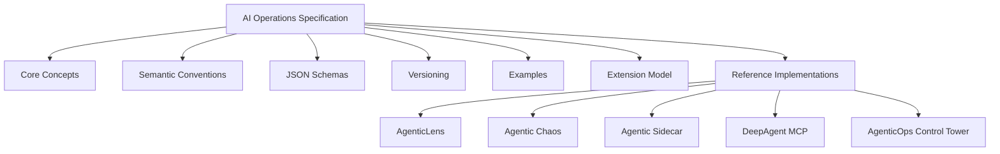
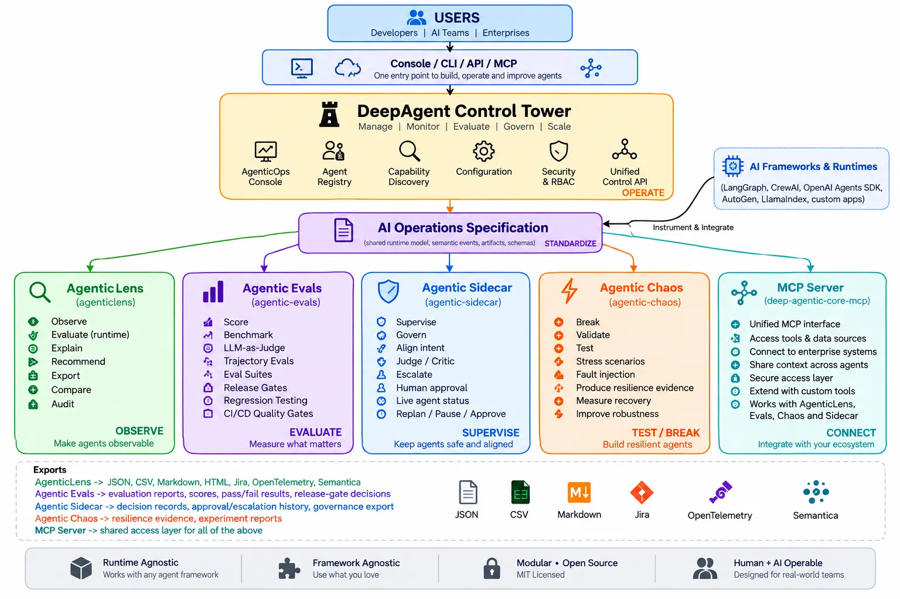
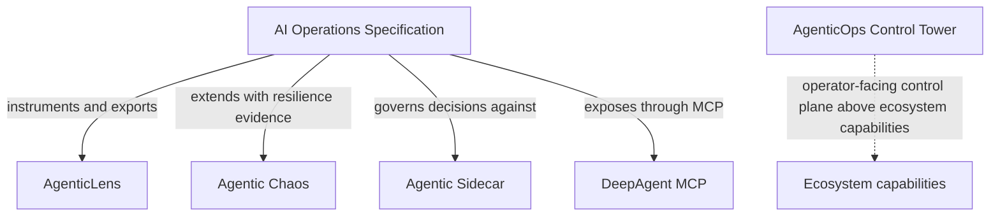

<h1 align="center">DeepAgentLabs</h1>

<strong>Open operational infrastructure for production AI systems.</strong>

The AI Operations Specification comes before SDK ergonomics, package features, dashboards, or integrations.

<a href="ROADMAP.md">Ecosystem roadmap</a>

---

## 01 / The Core Idea

DeepAgentLabs is built **specification-first**: define the language of AI operations before implementing package-specific behavior. The **AI Operations Specification** is the foundation; the ecosystem packages are reference implementations of that foundation.

It gives multiple tools a shared operational model so they can represent the same run consistently. The specification stays above any one package, allowing third parties to implement the contract without depending on the Python packages directly.

```mermaid
flowchart TB
    Spec["AI Operations Specification"]
    Spec --> Concepts["Core Concepts"]
    Spec --> Conventions["Semantic Conventions"]
    Spec --> Schemas["JSON Schemas"]
    Spec --> Versioning["Versioning"]
    Spec --> Examples["Examples"]
    Spec --> Extensions["Extension Model"]
    Spec --> Implementations["Reference Implementations"]
    Implementations --> Lens["AgenticLens"]
    Implementations --> Chaos["Agentic Chaos"]
    Implementations --> Sidecar["Agentic Sidecar"]
    Implementations --> MCP["DeepAgent MCP"]
    Implementations --> Tower["AgenticOps Control Tower"]
```

### Specification objects

The roadmap's initial operational objects:

| Runtime objects                           | Runtime activity and outcomes                  |
| ----------------------------------------- | ---------------------------------------------- |
| `Workflow` · `Request` · `Step` · `Agent` | `LLM` · `Prompt` · `Context` · `Tool`          |
| `Memory` · `RAG` · `Evaluation`           | Safety signal · Reliability event · `Incident` |

The Phase 1 questions also name an **LLM call**, **tool call**, **memory operation**, and **RAG retrieval**.

At Phase 1, the focus is on definitions, relationships, and terminology, not Python APIs or exporters.

---

## DeepAgentLabs Ecosystem

The specification defines a standard; each component has a distinct role against that shared model.

DeepAgentLabs is building an open, modular ecosystem for developing, operating, evaluating, and governing AI agents across real-world environments.

The ecosystem brings together a unified Control Tower, shared AI Operations Specification, and specialized open-source components for observing, evaluating, supervising, testing, and connecting AI agents.

    

```mermaid
flowchart TB
    Spec["AI Operations Specification"]
    Spec -->|instruments and exports| Lens["AgenticLens"]
    Spec -->|extends with resilience evidence| Chaos["Agentic Chaos"]
    Spec -->|governs decisions against| Sidecar["Agentic Sidecar"]
    Spec -->|exposes through MCP| MCP["DeepAgent MCP"]
    Tower["AgenticOps Control Tower"] -. "operator-facing control plane above ecosystem capabilities" .-> Capabilities["Ecosystem capabilities"]
```

| Component                                   | Role, specification relationship, and roadmap status                                                                                                                                                                  |
| ------------------------------------------- | --------------------------------------------------------------------------------------------------------------------------------------------------------------------------------------------------------------------- |
| **AI Operations Specification**             | Defines the standard and shared operational contract. **Phases:** 1–5. **Implement Now:** provenance/evidence concepts, conformance test suite, naming conventions.                                                   |
| **AgenticLens**                             | Observes and evaluates the standard; instruments and exports it. **Phase:** 6. **Status:** Implement Now and Implement Next; selected `0.4.0` work is marked shipped.                                                 |
| **Agentic Chaos**                           | Tests and stress-validates the standard; extends it with resilience evidence. **Phase:** 7. **Status:** Current frontier.                                                                                             |
| **DeepAgent MCP** (`deep-agentic-core-mcp`) | Connects the standard through MCP and exposes it through an MCP-native interface. **Phase:** 8. **Status:** Selected `0.2.0` work is marked shipped; remaining work is listed under Implement Now and Implement Next. |
| **Agentic Sidecar**                         | Governs decisions against the standard. **Phase:** 9. The roadmap does not state a current implementation status.                                                                                                     |
| **AgenticOps Control Tower**                | Operates the ecosystem through a control plane above its capabilities. **Phase:** 10. The roadmap does not state a current implementation status.                                                                     |

The Control Tower does not replace Lens, Chaos, Sidecar, or MCP.

### Core Components

| Component              | Purpose                                                                         |
| ---------------------- | ------------------------------------------------------------------------------- |
|   **AgenticLens**     | Observe, evaluate, explain, compare, and audit AI agent behavior                |
|   **Agentic Evals**   | Benchmark agents, run evaluations, regression tests, and quality gates          |
|   **Agentic Sidecar** | Supervise agents, govern intent, escalate decisions, and support human approval |
|   **Agentic Chaos**   | Stress-test agents through fault injection and resilience experiments           |
|   **MCP Server**      | Provide a unified interface for tools, data sources, and enterprise systems     |

### Built Around Open Standards

- **Runtime Agnostic** — works across different agent frameworks and runtimes
- **Framework Agnostic** — integrates with the tools and frameworks teams already use
- **Modular & Open Source** — independently usable components with open-source foundations
- **Human + AI Operable** — designed for real-world teams and human oversight

Together, these components provide an end-to-end approach to **observe → evaluate → supervise → test → connect** AI agents.

---

## 03 / Roadmap Timeline

The phase titles and sequence below follow the roadmap. The phase list describes goals, not completion status; status is called out separately only where the roadmap states it.

| Phase                                          | Purpose                                                                                                                                           |
| ---------------------------------------------- | ------------------------------------------------------------------------------------------------------------------------------------------------- |
| **01 — AI Operations Specification**           | Define the language of AI operations: objects, definitions, relationships, and terminology before package-specific behavior.                      |
| **02 — Relationships and Execution Structure** | Define how runtime objects connect, including workflow structure, parent-child relationships, execution graphs, and portable handoffs/delegation. |
| **03 — Semantic Conventions**                  | Define canonical AI-native event names and their meanings.                                                                                        |
| **04 — JSON Schemas**                          | Make artifacts validatable and portable through a schema-backed artifact model.                                                                   |
| **05 — Python Models**                         | Represent the specification in Python, with implementation models rather than independent ad hoc package types.                                   |
| **06 — AgenticLens**                           | Populate the specification from real Python runtime activity and export its artifacts and signals.                                                |
| **07 — Agentic Chaos**                         | Extend the same workflow artifact with resilience and failure evidence, not a parallel model.                                                     |
| **08 — DeepAgent MCP**                         | Expose the same artifact and model through one MCP-native interface.                                                                              |
| **09 — Agentic Sidecar**                       | Add pre-action supervision and decision governance against the same operational model.                                                            |
| **10 — AgenticOps Control Tower**              | Add the operator-facing control plane above ecosystem capabilities without replacing them.                                                        |

Phase details and examples

- **Phase 2:** A `Workflow` contains `Request`, `Step`, `Evaluation`, and `Incident`; a `Step` may represent or contain `LLM`, `Tool`, `RAG`, `Memory`, or other runtime activity. Execution may be sequential, parallel, or graph-shaped.
- **Phase 3:** Examples include `workflow.started`, `workflow.completed`, `request.started`, `request.completed`, `agent.started`, `agent.step`, `llm.call`, `prompt.rendered`, `context.injected`, `tool.called`, `memory.read`, `memory.write`, `rag.retrieved`, `evaluation.run`, `judge.scored`, and `incident.created`.
- **Phase 4:** Examples are `workflow.schema.json`, `agent.schema.json`, and `evaluation.schema.json`.
- **Phase 6:** Exports listed in the roadmap include `workflow.json`, JSON, CSV, Markdown, OpenTelemetry traces/logs/metrics, OTLP, and future transports.
- **Phase 8:** The documented MCP flow is `workflow.json` → `analyze()` → `recommend()` → `compare()` → `report()`.
- **Phase 10:** Centralize agent inventory, capability discovery, health and status rollups, configuration, and multi-agent operational workflows.

---

## 04 / Specification Milestones

| Milestone | Roadmap definition                                                                                                                                             |
| --------- | -------------------------------------------------------------------------------------------------------------------------------------------------------------- |
| **v0.1**  | Core concepts: `Workflow`, `Request`, `Step`, `Agent`, `LLM`, `Prompt`, `Tool`, `Context`, `RAG`, `Memory`, `Evaluation`, `Safety`, `Reliability`, `Incident`. |
| **v0.2**  | Relationships: workflow-to-step structure, parent-child relationships, and execution graph representation.                                                     |
| **v0.3**  | Semantic conventions: `workflow.started`, `llm.call`, `tool.call`, related canonical event names, and lifecycle meanings.                                      |
| **v0.4**  | JSON Schema support.                                                                                                                                           |
| **v0.5**  | Versioning and compatibility rules.                                                                                                                            |
| **v1.0**  | Stable public specification.                                                                                                                                   |

---

## 05 / Current Frontier

> **CURRENT FRONTIER · Agentic Chaos**
>
> **Structured experiment traces/reports** covering hypothesis, injection point, fault, observed behavior, recovery outcome, verdict, and provenance; plus **synthetic test scenarios** for prebuilt known-bad agent behaviors.

This is the roadmap's explicitly named current frontier in its recommended build order. The consolidated priorities also list Agentic Chaos resilience benchmark fixtures/datasets and parallel/sharded test execution under **Implement Next**.

---

## 06 / Implementation Priorities

These labels preserve the roadmap's own status terminology.

<strong>Implement Now</strong>

- **deep-agentic-core-mcp:** Provenance verification on `lens.analyze_workflow`'s response shape; multi-version AIOS schema support and conformance-style reporting, blocked on `ai-operations-spec` publishing `v0.4` schema artifacts and follow-on compatibility/versioning rules; unified observability + chaos workflows and incident/readiness reporting (Phase 4). The roadmap marks sessions, rich diagnostics, tool annotations, prompt registry, and `core.verify` as shipped in `0.2.0`.
- **agenticlens:** Judge calibration reports and statistical confidence intervals; evaluation dataset management; built-in provider clients for LLM-judge calls; next release: experiment/variant manifests and statistical comparison. The roadmap marks evidence/provenance objects, next-best-analysis guidance, OpenTelemetry export, import-layer enforcement, and AIOS conformance CLI as shipped in `0.4.0`.
- **agentic-chaos:** Structured experiment traces/reports and synthetic test scenarios, as described in the current frontier above.
- **ai-operations-spec:** Provenance/evidence concepts, a conformance test suite for producers, and a naming conventions document.
- **Cross-cutting (done):** `AGENTS.md` in each repo; `CI.md` pre-push quality guide in each repo.

<strong>Implement Next</strong>

- **agenticlens:** Investigation-style recommendation narratives; remaining CLI subcommands (`trace show`, `report explain`; `inspect` and `compare` are marked shipped); analysis guardrails (budget limits, stagnation detection); structured judge verdict fields on `LLMJudgeEvaluator` (agree/partially-agree/disagree, confidence score, factual-grounding breakdown).
- **agentic-chaos:** Resilience benchmark fixtures/datasets; parallel/sharded test execution.
- **ai-operations-spec:** Migration guides between spec versions; hosted docs site; report/investigation artifact schemas.
- **deep-agentic-core-mcp:** Guided onboarding wizard; saved artifact browsing through MCP resources; explainable report recall and session history.

<strong>Defer</strong>

- `agenticlens` full interactive REPL/shell
- `agentic-chaos` local chaos-lab stack (Docker Compose/kind)
- `deep-agentic-core-mcp` fleet/process registry
- `deep-agentic-core-mcp` full gateway/multi-surface architecture
- Conversational long-term memory in `agenticlens` or `agentic-chaos`

### Recommended build order

1. ~~**deep-agentic-core-mcp** — sessions, diagnostics, tool metadata, prompts, verification~~ · shipped in `0.2.0`
2. ~~**agenticlens** — provenance/evidence, next-step recommendations, OTel, layer enforcement, conformance CLI~~ · shipped in `0.4.0`
3. **agentic-chaos** — structured reports/traces, synthetic scenarios · **current frontier**
4. **ai-operations-spec** — provenance/evidence/report semantics, naming rules, conformance requirements and fixtures

---

## 07 / Development Principles

| Principle                              | Roadmap expression                                                                                                                                                       |
| -------------------------------------- | ------------------------------------------------------------------------------------------------------------------------------------------------------------------------ |
| **Specification-first**                | The AI Operations Specification comes before SDK ergonomics, package features, dashboards, or integrations.                                                              |
| **One shared contract**                | The specification defines the standard; implementations instrument/export it, extend it with resilience evidence, expose it through MCP, or govern decisions against it. |
| **Clean separation**                   | Keep the specification above any one package so third parties can implement the contract without depending on the Python packages directly.                              |
| **Models implement the specification** | Python models should represent the specification, not introduce independent ad hoc package types.                                                                        |

---

## 08 / North Star

> The long-term goal is not just a Python toolkit. It is an **open operational standard for AI systems** with a shared object model, shared semantic conventions, shared schemas, shared examples, additive extensions, and multiple interoperable implementations.

---

## Project Navigation

| Area                              | Destination                                                                           |
| --------------------------------- | ------------------------------------------------------------------------------------- |
| Roadmap                           | [profile/ROADMAP.md](ROADMAP.md)                                                      |
| Specification                     | [ai-operations-spec](https://github.com/DeepAgentLabs/ai-operations-spec)             |
| Observability and evaluation      | [agenticlens](https://github.com/DeepAgentLabs/agenticlens)                           |
| Resilience and failure validation | [agentic-chaos](https://github.com/DeepAgentLabs/agentic-chaos)                       |
| MCP                               | [deep-agentic-core-mcp](https://github.com/DeepAgentLabs/mcp-server)                  |
| Decision governance               | [agentic-sidecar](https://github.com/DeepAgentLabs/agentic-sidecar)                   |
| Control plane                     | [agenticops-control-tower](https://github.com/DeepAgentLabs/agenticops-control-tower) |
