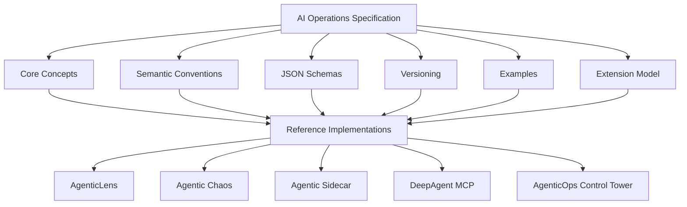
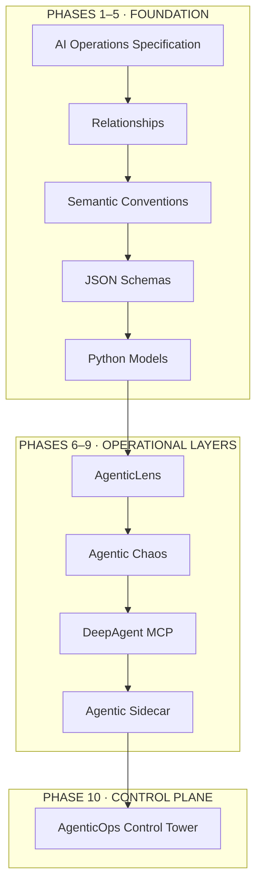
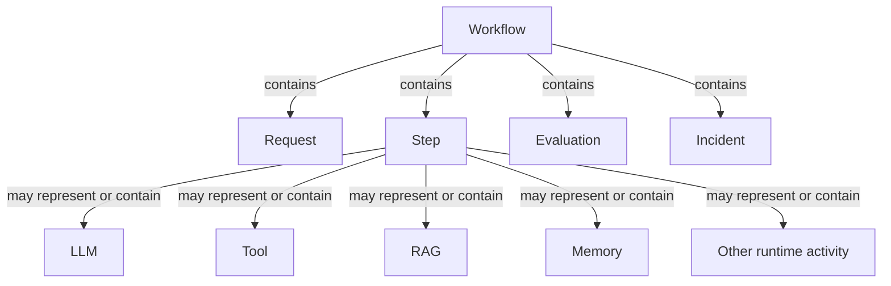
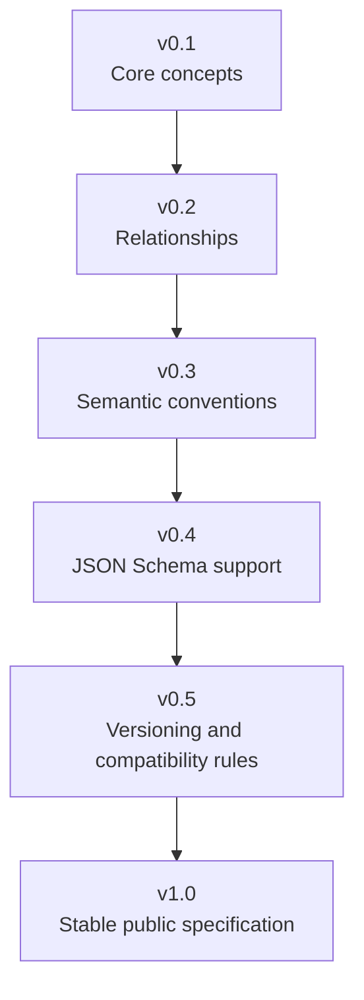
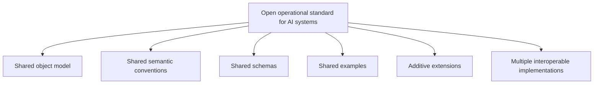

# DeepAgentLabs Roadmap

> DeepAgentLabs should be built **specification-first** toward an **open operational standard for AI systems**.

The AI Operations Specification comes before SDK ergonomics, package features, dashboards, or integrations. The specification is the foundation; the packages are reference implementations of that foundation.

## 🧭 Direction

DeepAgentLabs should follow the pattern used by the strongest ecosystems:

| Ecosystem     | Defined first                            |
| ------------- | ---------------------------------------- |
| OpenTelemetry | Telemetry model and semantic conventions |
| Kubernetes    | API objects                              |
| OpenAPI       | Interface specification                  |

The specification should stay above any one package. Multiple tools should share the same operational contract, and third parties should be able to implement that contract without depending on the Python packages directly.

## 🏗️ Specification-First Architecture



The **AI Operations Specification is the foundation**. It defines the shared concepts, conventions, schemas, versioning, examples, and extension model before package-specific behavior.

The packages are **reference implementations** of that foundation. They should not invent a parallel operational model or independent package types; Python models should represent the specification directly.

This separation keeps the specification above any one package and makes it possible for third parties to implement the contract without taking a dependency on the Python packages.

## 🗺️ Ecosystem Build Journey

This overview groups the numbered phases to make the progression easier to scan; the detailed phase goals follow below.



## 📐 AI Operations Specification

### Initial operational objects

Phase 1 defines the language of AI operations. Questions to answer:

- what is a workflow
- what is a request
- what is a step
- what is an agent
- what is an LLM call
- what is a prompt
- what is a context object
- what is a tool call
- what is a memory operation
- what is a RAG retrieval
- what is an evaluation
- what is a safety signal
- what is a reliability event
- what is an incident

The initial operational objects are:

| Runtime objects                           | Runtime activity and outcomes         |
| ----------------------------------------- | ------------------------------------- |
| `Workflow` · `Request` · `Step` · `Agent` | `LLM` · `Prompt` · `Context` · `Tool` |
| `Memory` · `RAG` · `Evaluation`           | `Safety` · `Reliability` · `Incident` |

At this stage, the focus is on **definitions, relationships, and terminology**, not Python APIs or exporters.

### Explicitly defined relationships

The diagram below shows only relationships stated in Phase 2. A `Step` may represent or contain the listed runtime activity or other runtime activity.



### Phase 3 semantic conventions

Canonical AI-native event names and meanings give the ecosystem consistent language for AI runtimes. The roadmap's examples are grouped by subject here for scanning; no additional event names are implied.

| Subject    | Event names                               |
| ---------- | ----------------------------------------- |
| Workflow   | `workflow.started` · `workflow.completed` |
| Request    | `request.started` · `request.completed`   |
| Agent      | `agent.started` · `agent.step`            |
| LLM        | `llm.call`                                |
| Prompt     | `prompt.rendered`                         |
| Context    | `context.injected`                        |
| Tool       | `tool.called`                             |
| Memory     | `memory.read` · `memory.write`            |
| RAG        | `rag.retrieved`                           |
| Evaluation | `evaluation.run` · `judge.scored`         |
| Incident   | `incident.created`                        |

This is where the ecosystem starts to feel analogous to OpenTelemetry semantic conventions, but for AI runtimes.

## 🔭 10-Phase Roadmap

```text
01 ── AI Operations Specification
 │
02 ── Relationships and Execution Structure
 │
03 ── Semantic Conventions
 │
04 ── JSON Schemas
 │
05 ── Python Models
 │
06 ── AgenticLens
 │
07 ── Agentic Chaos
 │
08 ── DeepAgent MCP
 │
09 ── Agentic Sidecar
 │
10 ── AgenticOps Control Tower
```

### Phase 1 — AI Operations Specification

**Goal:** Define the language of AI operations before implementing package-specific behavior.

**Questions:** What is a workflow, request, step, agent, LLM call, prompt, context object, tool call, memory operation, RAG retrieval, evaluation, safety signal, reliability event, or incident?

**Initial operational objects:** `Workflow`, `Request`, `Step`, `Agent`, `LLM`, `Prompt`, `Context`, `Tool`, `Memory`, `RAG`, `Evaluation`, `Safety`, `Reliability`, `Incident`.

**Focus:** Definitions → relationships → terminology. Not Python APIs or exporters.

### Phase 2 — Relationships and Execution Structure

**Goal:** Define how the runtime objects connect.

- `Workflow` contains `Request`, `Step`, `Evaluation`, and `Incident`.
- `Step` may represent or contain `LLM`, `Tool`, `RAG`, `Memory`, or other runtime activity.
- Workflows may have parent-child relationships.
- Execution may be sequential, parallel, or graph-shaped.
- Agent handoffs and delegation should have a portable representation.

Define the execution graph model clearly enough that multiple tools can represent the same run consistently.

### Phase 3 — Semantic Conventions

**Goal:** Define canonical AI-native event names and meanings.

See the grouped event table above for every example in the roadmap. This is the point where the ecosystem starts to feel analogous to OpenTelemetry semantic conventions, but for AI runtimes.

### Phase 4 — JSON Schemas

**Goal:** Make artifacts validatable and portable.

Examples: `workflow.schema.json`, `agent.schema.json`, `evaluation.schema.json`, and future object-specific schemas. The output is a schema-backed artifact model that tools can produce and consume consistently.

### Phase 5 — Python Models

**Goal:** Represent the specification directly in Python.

Examples: `Workflow`, `Step`, `Agent`, `Prompt`, `ToolCall`, and `Evaluation`. These should be implementation models of the specification, not ad hoc package types invented independently in each repo.

### Phase 6 — AgenticLens

**Goal:** Make the specification observable in Python applications.

AgenticLens should populate the AI Operations Specification from real runtime activity, then export it as:

- `workflow.json`
- JSON, CSV, and Markdown
- OpenTelemetry traces, logs, and metrics
- OTLP and future transports

AgenticLens should answer:

- What ran?
- Why did it behave that way?
- What did it cost?
- Did it perform well?

### Phase 7 — Agentic Chaos

**Goal:** Extend the same operational model with resilience and failure evidence.

Agentic Chaos should not invent a parallel model. It should extend the same workflow artifact with chaos and degradation evidence.

Agentic Chaos should answer:

- What breaks under stress?
- How badly does it break?
- Did recovery work?

### Phase 8 — DeepAgent MCP

**Goal:** Expose the same artifact and model through one MCP-native interface.

The MCP server should read and operate on the shared operational contract:

```text
workflow.json
    ↓
analyze()
recommend()
compare()
report()
```

This keeps the MCP layer thin, portable, and aligned with the rest of the ecosystem.

### Phase 9 — Agentic Sidecar

**Goal:** Add pre-action supervision and decision governance against the same operational model.

Agentic Sidecar should answer:

- Is the next action aligned with user intent?
- Is the action policy-compliant?
- Does the action require escalation, replanning, or blocking?

### Phase 10 — AgenticOps Control Tower

**Goal:** Add the operator-facing control plane above the ecosystem capabilities.

AgenticOps Control Tower should not replace Lens, Chaos, Sidecar, or MCP. It should centralize:

- Agent inventory
- Capability discovery
- Health and status rollups
- Centralized configuration
- Multi-agent operational workflows

It should answer:

- What is deployed?
- Where is it running?
- Which capabilities and versions are present?
- What is unhealthy?
- What should operators manage from one place?

## 📦 Package Roles

| Package                    | Role                                            |
| -------------------------- | ----------------------------------------------- |
| `ai-operations-spec`       | Defines the standard.                           |
| `agenticlens`              | Observes and evaluates the standard.            |
| `agentic-chaos`            | Tests and stress-validates the standard.        |
| `agentic-sidecar`          | Governs decisions against the standard.         |
| `deep-agentic-core-mcp`    | Connects the standard through MCP.              |
| `agenticops-control-tower` | Operates the ecosystem through a control plane. |

The ecosystem should stay cleanly separated:

- `ai-operations-spec` defines the standard.
- `agenticlens` instruments and exports the standard.
- `agentic-chaos` extends the standard with resilience evidence.
- `deep-agentic-core-mcp` exposes the standard through MCP.

The specification stays above any one package, making ecosystem adoption easier for third parties that want to implement the contract without depending on the Python packages directly.

## 📋 Specification Milestones

The AI Operations Specification itself should evolve in these milestones. The sequence below describes milestone scope; it does not imply completion status.



<details>
<summary>Milestone scope</summary>

| Milestone | Exact scope                                                                                                                                                    |
| --------- | -------------------------------------------------------------------------------------------------------------------------------------------------------------- |
| **v0.1**  | Core concepts: `Workflow`, `Request`, `Step`, `Agent`, `LLM`, `Prompt`, `Tool`, `Context`, `RAG`, `Memory`, `Evaluation`, `Safety`, `Reliability`, `Incident`. |
| **v0.2**  | Relationships: workflow-to-step structure, parent-child relationships, execution graph representation.                                                         |
| **v0.3**  | Semantic conventions: `workflow.started`, `llm.call`, `tool.call`, related canonical event names and lifecycle meanings.                                       |
| **v0.4**  | JSON Schema support.                                                                                                                                           |
| **v0.5**  | Versioning and compatibility rules.                                                                                                                            |
| **v1.0**  | Stable public specification.                                                                                                                                   |

</details>

## 🚧 Current Implementation Priorities

The following items are the current implementation priorities, grouped by the roadmap's urgency labels. Items remain in their source categories.

### 🔴 Implement Now

**`deep-agentic-core-mcp`** — _(sessions, rich diagnostics, tool annotations,
prompt registry, and `core.verify` in `0.2.0`; optional authenticated HTTP,
DynamoDB signup/key lifecycle, Redis user-scoped state, and Sidecar discovery
in `0.3.0`)_

Local stdio remains supported. Hosted access is available at
`https://mcp.deepagentlabs.io/mcp`, with signup at `https://mcp.deepagentlabs.io`.
Version-tag releases publish to PyPI before deploying the same source to AWS;
ordinary main-branch pushes run checks without deploying.

- Provenance verification on `lens.analyze_workflow`'s response shape.
- Multi-version AIOS schema support + conformance-style reporting, blocked on `ai-operations-spec` publishing `v0.4` schema artifacts and follow-on compatibility/versioning rules.
- Unified workflows: joined observability + chaos, incident/readiness reporting (Phase 4).

**`agenticlens`** — _(evidence/provenance objects, next-best-analysis guidance, OpenTelemetry export, import-layer enforcement, and AIOS conformance CLI shipped in `0.4.0`)_

- Judge calibration reports and statistical confidence intervals.
- Evaluation dataset management.
- Built-in provider clients for LLM-judge calls.
- Next release: experiment/variant manifests and statistical comparison.

**`agentic-chaos`**

- Structured experiment traces/reports (hypothesis, injection point, fault, observed behavior, recovery outcome, verdict, provenance).
- Synthetic test scenarios (prebuilt known-bad agent behaviors).

**`ai-operations-spec`**

- Provenance/evidence concepts in the spec.
- Conformance test suite for producers.
- Naming conventions document.

**Cross-cutting (done)**

- `AGENTS.md` in each repo ✅
- `CI.md` pre-push quality guide in each repo ✅

### 🟡 Implement Next

**`agenticlens`**

- Investigation-style narratives on recommendations.
- Remaining CLI subcommands (`trace show`, `report explain` — `inspect` and `compare` already shipped).
- Analysis guardrails (budget limits, stagnation detection).
- Structured judge verdict fields on `LLMJudgeEvaluator` (agree/partially-agree/disagree, confidence score, factual-grounding breakdown).

**`agentic-chaos`**

- Resilience benchmark fixtures/datasets.
- Parallel/sharded test execution.

**`ai-operations-spec`**

- Migration guides between spec versions.
- Hosted docs site.
- Report/investigation artifact schemas.

**`deep-agentic-core-mcp`**

- Guided onboarding wizard.
- Saved artifact browsing through MCP resources.
- Explainable report recall and session history.

### ⚪ Defer

- `agenticlens` full interactive REPL/shell.
- `agentic-chaos` local chaos-lab stack (Docker Compose/kind).
- `deep-agentic-core-mcp` fleet/process registry.
- `deep-agentic-core-mcp` full gateway/multi-surface architecture.
- Conversational long-term memory in `agenticlens` or `agentic-chaos`.

## 🧩 Recommended Build Order

This is the roadmap's recommended order; shipped annotations and the named frontier are retained as stated.

| Order | Work                                                                                                             | Roadmap status                            |
| ----: | ---------------------------------------------------------------------------------------------------------------- | ----------------------------------------- |
|     1 | `deep-agentic-core-mcp` — sessions, diagnostics, tool metadata, prompts, verification                            | ~~✅ shipped in `0.2.0`~~                 |
|     2 | `agenticlens` — provenance/evidence, next-step recommendations, OTel, layer enforcement, conformance CLI         | ~~✅ shipped in `0.4.0`~~                 |
|     3 | `agentic-chaos` — structured reports/traces, synthetic scenarios                                                 | **current frontier**                      |
|     4 | `ai-operations-spec` — provenance/evidence/report semantics, naming rules, conformance requirements and fixtures | No status stated in this build-order list |

### Current frontier

> **Agentic Chaos** — structured experiment traces/reports (hypothesis, injection point, fault, observed behavior, recovery outcome, verdict, provenance) and synthetic test scenarios (prebuilt known-bad agent behaviors).

## 🌐 North Star

The long-term goal is not just a Python toolkit. It is an **open operational standard for AI systems** with a shared object model, shared semantic conventions, shared schemas, shared examples, additive extensions, and multiple interoperable implementations.


